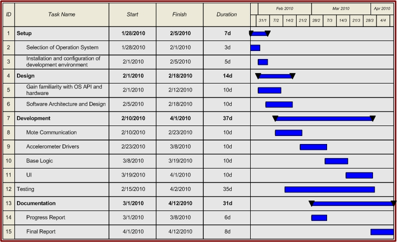

Project Proposal
================

MEMORANDUM
----------

| To: Ms. J. Pavelich, Prof. S. Gopalakrishnan
| From: Jason Poon
| Date: |date|
| Re: EECE 496 - Project Proposal

----

**Introduction**

The project I would like to propose for EECE 496 is the implementation of a fall detection system. The purpose and significance of such a system are outlined below; in addition, details regarding the requirements and timeline are included.

**Project Objectives**

The purpose of this project will be to implement a fall detection system.
With the usage of multiple sensor nodes places around one's body, it is the goal of the system to aggregate data from the various sensors and detect if a fall has taken place.

**Project Significance**

A fall detection system can prove very useful for senior citizens where a fall may be very dangerous.
With the usage of a fall detection system, it is then possible to monitor one's activities and, in the case of a fall, automatically notify the authorities (e.g. caregiver) such that they can immediately respond to the situation.
Such a system can also be applied any individual monitor their exercise routine and provide an analysis of the data.

**Project Requirements**

In order for this project to succeed, the following items will be required:

* Sensor Module
    - An accelerometer will be used to detect the motion of the user and to determine the current state in which the user is in (e.g. standing, sitting, falling, walking)
* Wireless Sensor Network
    - In order to coordinate data retrieved from the various sensors placed around the body, a wireless sensor network will be required.

**Project Timeline**

    Figure 1 - Gantt chart outlining schedule for project

**Conclusion**

The included gantt chart will be used as a guideline for the scheduling of tasks.
In following the gantt chart, the successful completion of a system able to detect an individual's current state should result.
If you have any questions regarding this proposal, feel free to contact me via email at eece496@jasonpoon.ca.

|
|
|
|

*Jason Poon*

.. |date| date:: %B %d, %Y
